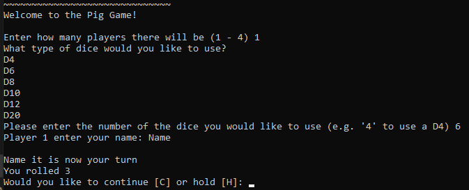
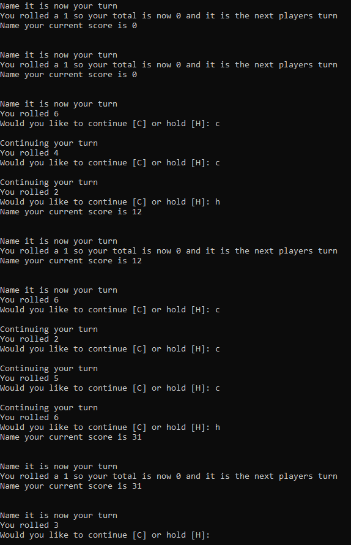
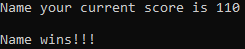

```python
import random
## FUNCTIONS ##
def diceRoll(dice):
    diceChoice = dice
    roundScore = 0
    playerTurn = True

    while playerTurn == True:
        if diceChoice == 4:
            rolledDice = random.randint(1,4)
        elif diceChoice == 6:
            rolledDice = random.randint(1,6)
        elif diceChoice == 8:
            rolledDice = random.randint(1,8)
        elif diceChoice == 10:
            rolledDice = random.randint(1,10)
        elif diceChoice == 12:
            rolledDice = random.randint(1,12)
        elif diceChoice == 20:
            rolledDice = random.randint(1,20)
        if rolledDice == 1:
            roundScore = 0
            print("You rolled a 1 so your total is now 0 and it is the next players turn")
            return roundScore
        else:
            print(f"You rolled {rolledDice}")
            hold = input("Would you like to continue [C] or hold [H]: ")
            if hold.upper() == "C":
                print(" ")
                print("Continuing your turn")
                roundScore += rolledDice
            elif hold.upper() == "H":
                roundScore += rolledDice
                return roundScore


## MAIN ##
import random
## FUNCTIONS ##
def diceRoll(dice):
    diceChoice = dice
    roundScore = 0
    playerTurn = True

    while playerTurn == True:
        if diceChoice == 4:
            rolledDice = random.randint(1,4)
        elif diceChoice == 6:
            rolledDice = random.randint(1,6)
        elif diceChoice == 8:
            rolledDice = random.randint(1,8)
        elif diceChoice == 10:
            rolledDice = random.randint(1,10)
        elif diceChoice == 12:
            rolledDice = random.randint(1,12)
        elif diceChoice == 20:
            rolledDice = random.randint(1,20)
        if rolledDice == 1:
            roundScore = 0
            print("You rolled a 1 so your total is now 0 and it is the next players turn")
            return roundScore
        else:
            print(f"You rolled {rolledDice}")
            hold = input("Would you like to continue [C] or hold [H]: ")
            if hold.upper() == "C":
                print(" ")
                print("Continuing your turn")
                roundScore += rolledDice
            elif hold.upper() == "H":
                roundScore += rolledDice
                return roundScore


## MAIN ##
iPlayer1Score = 0
iPlayer2Score = 0
iPlayer3Score = 0
iPlayer4Score = 0


sPlayer1 = ""
sPlayer2 = ""
sPlayer3 = ""
sPlayer4 = ""
# Start menu for the game

print("~~~~~~~~~~~~~~~~~~~~~~~~~~~~~~\n\
Welcome to the Pig Game!\n ")
# iGameMode = int(input("[game modes]"))
iPlayerNumber = int(input("Enter how many players there will be (1 - 4) "))
iDiceChoice = int(input("What type of dice would you like to use?\n\
D4\n\
D6\n\
D8\n\
D10\n\
D12\n\
D20\n\
Please enter the number of the dice you would like to use (e.g. '4' to use a D4) "))
                        


if iPlayerNumber == 1:
    sPlayer1 = input("Player 1 enter your name: ")
    while iPlayer1Score < 100:
        print(" ")
        print(f"{sPlayer1} it is now your turn")
        iPlayer1Score += diceRoll(iDiceChoice)
        print(f"{sPlayer1} your current score is {iPlayer1Score}")
        print(" ")

elif iPlayerNumber == 2:
    sPlayer1 = input("Player 1 enter your name: ")
    sPlayer2 = input("Player 2 enter your name: ")
    while iPlayer1Score < 100 and iPlayer2Score < 100:
        print(" ")
        print(f"{sPlayer1} it is now your turn")
        iPlayer1Score += diceRoll(iDiceChoice)
        print(f"{sPlayer1} your current score is {iPlayer1Score}")
        print(" ")

        print(" ")
        print(f"{sPlayer2} it is now your turn")
        iPlayer2Score += diceRoll(iDiceChoice)
        print(f"{sPlayer2} your current score is {iPlayer2Score}")
        print(" ")

elif iPlayerNumber == 3:
    sPlayer1 = input("Player 1 enter your name: ")
    sPlayer2 = input("Player 2 enter your name: ")
    sPlayer3 = input("Player 3 enter your name: ")
    while iPlayer1Score < 100 and iPlayer2Score < 100:
        print(" ")
        print(f"{sPlayer1} it is now your turn")
        iPlayer1Score += diceRoll(iDiceChoice)
        print(f"{sPlayer1} your current score is {iPlayer1Score}")
        print(" ")

        print(" ")
        print(f"{sPlayer2} it is now your turn")
        iPlayer2Score += diceRoll(iDiceChoice)
        print(f"{sPlayer2} your current score is {iPlayer2Score}")
        print(" ")

        print(" ")
        print(f"{sPlayer3} it is now your turn")
        iPlayer2Score += diceRoll(iDiceChoice)
        print(f"{sPlayer3} your current score is {iPlayer3Score}")
        print(" ")

            

elif iPlayerNumber == 4:
    sPlayer1 = input("Player 1 enter your name: ")
    sPlayer2 = input("Player 2 enter your name: ")
    sPlayer3 = input("Player 3 enter your name: ")
    sPlayer4 = input("Player 4 enter your name: ")
    while iPlayer1Score < 100 and iPlayer2Score < 100:
        print(" ")
        print(f"{sPlayer1} it is now your turn")
        iPlayer1Score += diceRoll(iDiceChoice)
        print(f"{sPlayer1} your current score is {iPlayer1Score}")
        print(" ")

        print(" ")
        print(f"{sPlayer2} it is now your turn")
        iPlayer2Score += diceRoll(iDiceChoice)
        print(f"{sPlayer2} your current score is {iPlayer2Score}")
        print(" ")

        print(" ")
        print(f"{sPlayer3} it is now your turn")
        iPlayer2Score += diceRoll(iDiceChoice)
        print(f"{sPlayer3} your current score is {iPlayer3Score}")
        print(" ")

        print(" ")
        print(f"{sPlayer4} it is now your turn")
        iPlayer2Score += diceRoll(iDiceChoice)
        print(f"{sPlayer4} your current score is {iPlayer4Score}")
        print(" ")


if iPlayer1Score >= 100:
    print(f"{sPlayer1} wins!!!")
elif iPlayer2Score >= 100:
    print(f"{sPlayer2} wins!!!")
elif iPlayer3Score >= 100:
    print(f"{sPlayer3} wins!!!")
elif iPlayer4Score >= 100:
    print(f"{sPlayer4} wins!!!")
    
    
```


### Outputs
Menu and setup options example:


Gameplay example:


Winning example:
