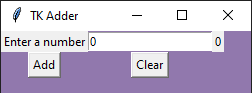
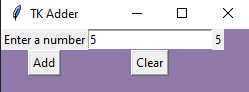
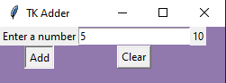

# TK Adder

## Code

```python
from tkinter import *

screen = Tk()
entry_var = IntVar()
total = 0

## FUNCTIONS ##
def addNumber():
    global total, total_label
    enteredNumber = entry_box.get()
    total = total + int(enteredNumber)
    total_label['text'] = total
    return total
    
def clear():
    global total
    total = 0
    total_label["text"] = total
    return total

## MAIN ##


screen.geometry("400x400")
screen.title("TK Adder")
screen["bg"] = "#9178ad"

entry_box = Entry(textvariable = entry_var)
entry_box.grid(row = 0, column = 1)

entry_label = Label(text = "Enter a number")
entry_label.grid(row = 0, column = 0)

add_button = Button(text = "Add", command = addNumber).grid(row = 1, column = 0)
clear_button = Button(text = "Clear", command = clear).grid(row = 1, column = 1)

var = 0
total_label = Label(text = "0")
total_label.grid(row = 0, column = 2)

screen.mainloop()
```

## Outputs
Image of the adder before anything has been input 




Image of the adder once a number has been input




Image of the adder once a second number has been added


